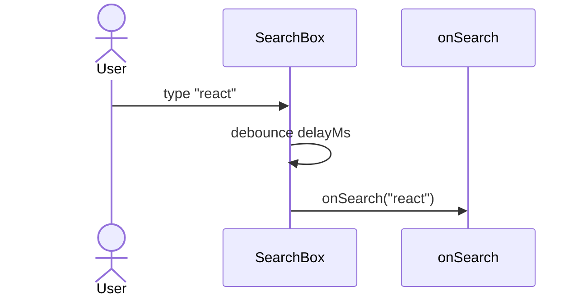

# BUILD BRIEF: Search box

A debounced search input. It renders a textbox, and after the user stops typing
for `delayMs`, it calls `onSearch` once with the current query. Empty queries
are never dispatched, and a fresh keystroke cancels a pending dispatch.


## Target API (implement exactly these signatures)

Module: `../components/SearchBox`

```tsx
export interface SearchBoxProps { onSearch: (query: string) => void; delayMs?: number; placeholder?: string }
export function SearchBox(props: SearchBoxProps): JSX.Element
```

## Collaboration contract

The implementation must produce these interactions, in order —
the suite asserts recorded call sequences against them.



## Test manifest (4 cases, all currently red)

| Test | Scenario | Kind | Covers |
|------|----------|------|--------|
| `renders a textbox with the placeholder` | Rendering the input | scenario | rule_1, M1 |
| `calls onSearch once after the debounce elapses` | Debounced dispatch | scenario | rule_2, M2, M3 |
| `never dispatches an empty query` | Empty query is ignored | edge case | edge_1 |
| `a fresh keystroke cancels the pending dispatch` | Debounce cancellation | edge case | edge_2 |

### Message traceability

| Message | Interaction | Tests |
|---------|-------------|-------|
| M1 | User → SearchBox: type "react" | `renders a textbox with the placeholder` |
| M2 | SearchBox → SearchBox: debounce delayMs | `calls onSearch once after the debounce elapses` |
| M3 | SearchBox → onSearch: onSearch("react") | `calls onSearch once after the debounce elapses` |

### Rule/edge traceability

| Id | Rule/Edge | Tests |
|----|-----------|-------|
| rule_1 | Renders a textbox using the provided placeholder. | `renders a textbox with the placeholder` |
| rule_2 | After the user stops typing for delayMs, onSearch is called once with the query. | `calls onSearch once after the debounce elapses` |
| edge_1 | An empty (whitespace-only) query never dispatches onSearch. | `never dispatches an empty query` |
| edge_2 | A keystroke within the debounce window cancels the previous pending dispatch. | `a fresh keystroke cancels the pending dispatch` |

## Rules

- The tests in `examples/generated/search_box.test.tsx` are the specification. They are
  read-only during implementation — if a test looks wrong, stop and
  flag it; do not adapt the test to the implementation.
- Each test's first line is a `bddPending()` marker. Delete exactly
  that one line per test as you make it pass; change nothing else.
- Implement only the API surface listed above; keep everything else
  private.

## Definition of done

`vitest run examples/generated/search_box.test.tsx` passes with the only edit being the removal
of each test's `bddPending()` marker line.
